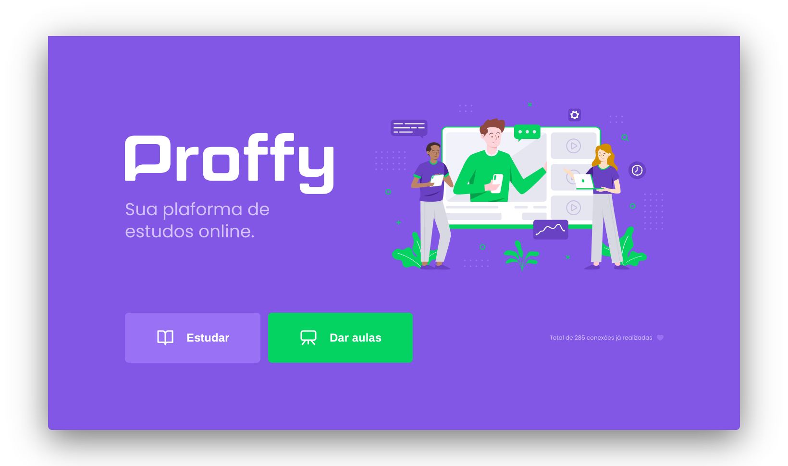

<h1 align="center">
    
</h1>

<p align="center">
  
  
  <a href="https://www.linkedin.com/in/jeffersonsjunior/">
    
  </a>
  <a href="https://github.com/jefferson1104/Proffy/commits/master">
    
  </a>
  
</p>

<p align="center">
  <a target="_blank" href="https://nodejs.org/">
    
  </a>
  <a href="https://reactjs.org/">
    
  </a>
 <a href="https://reactnative.dev/">
    
  </a>
</p>

<h3 align="center">
  
</h3>

# 💻 About project
Proffy - It's a platform where you can study or teach. A teacher putting his data, the subject he wants to teach, and choosing the best time to teach his class. Thus, the registered data were available on the website where students can choose the teacher that best fits their preferences.


# 🚀 How to run this project
The project is divided into three parts:

1. Back-end
2. Front-end
3. Mobile App

> 💡 Both Front-end and Mobile App need the Back-end to be running to work.

## :cyclone: Cloning the repository
```bash
# Cloning the repository
$ git clone https://github.com/jefferson1104/Proffy.git

# Access the project directory
$ cd Proffy
```

## Running the web server (Back-end)
```bash
# Access the server project directory
$ cd backend

# Install dependencies
$ npm install

# Run the Migrates
$ npm run knex:migrate

# Run the API
$ npm run start

# The server will start at port:3333 - access http://localhost:3333
```

## Running the web application (Front-end)
```bash
# Access the front-end project directory
$ cd web

# Install dependencies
$ npm install

# Run app
$ npm run start

# The application will open at port:3000 - access http://localhost:3000
```

## Running the app (Mobile App)

```bash
# Access the Mobile App project directory
$ cd mobile

# Install dependencies
$ npm install

# Run app
$ npm run start

# The application will open at port:19002 - access http://localhost:19002

# Use the app expo downloaded on your mobile to scan the QRCode
```

## 🎨 Layout
<table>
  <tr>
    <td colspan="2"><h4 align="center">Desktop</h4> </td>
    <td colspan="2"><h4 align="center">Mobile</h4></td>
  </tr>
  <tr>
    <td></td><td></td>
    <td></td><td></td>
  </tr>
</table>